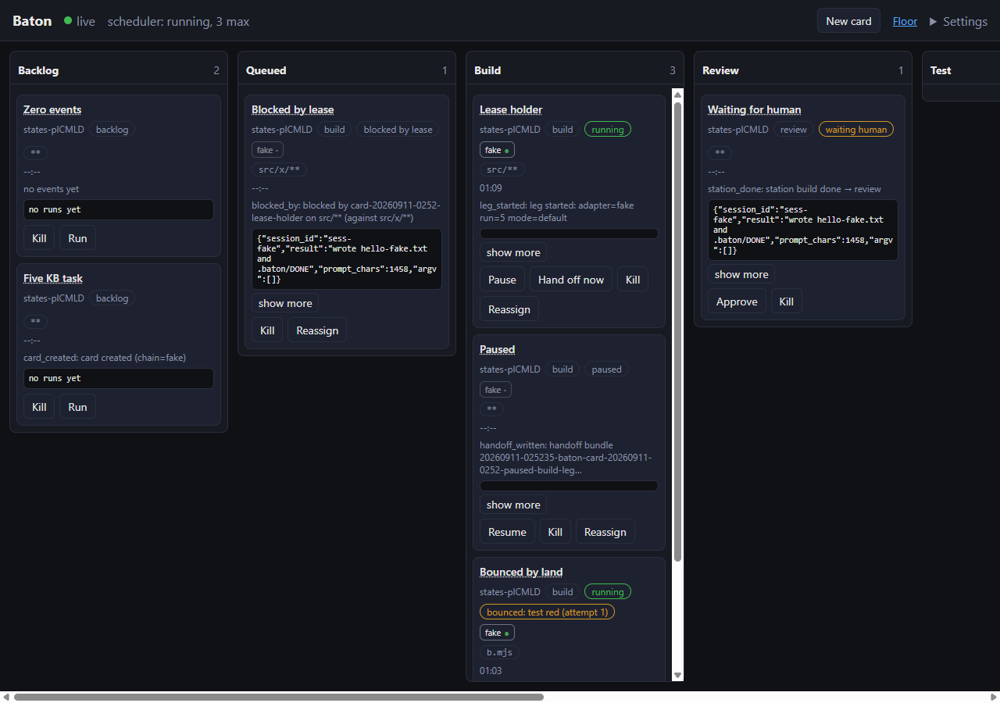
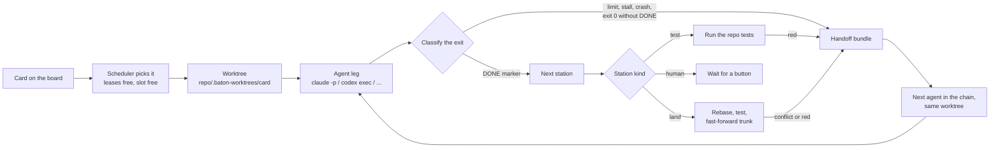
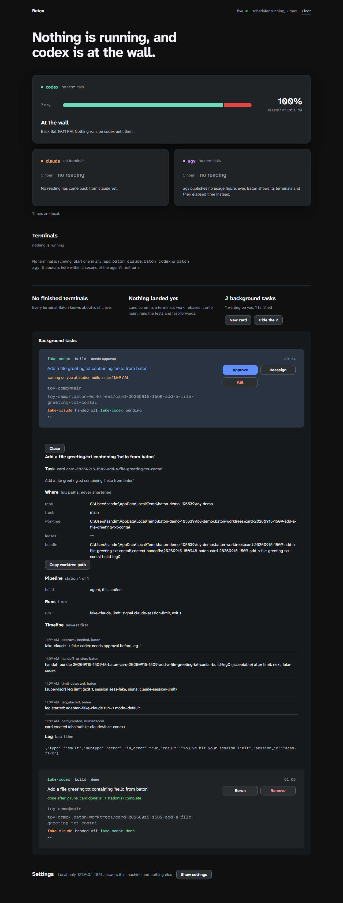
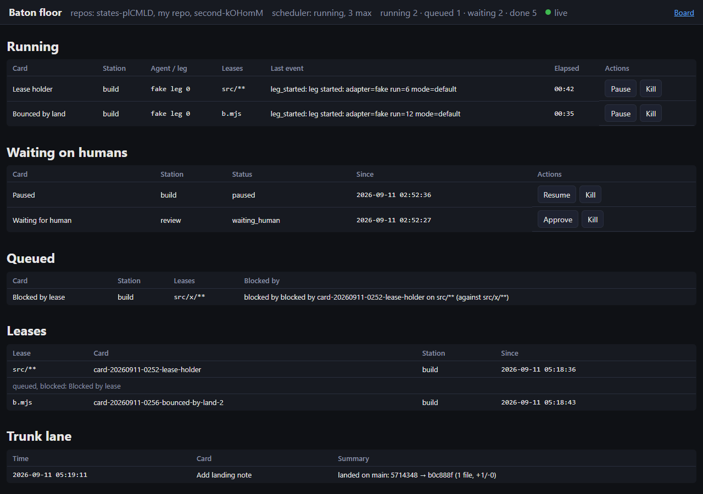

# baton

**A local kanban board that hands a coding agent's unfinished work to the next agent when the first one hits its usage limit.**

[](https://github.com/ucsandman/baton/actions/workflows/ci.yml)
[](LICENSE)
[](package.json)
[](package.json)
[](#network-exposure)



You drop a task card on the board and give it a fallback chain: Claude Code,
then Codex, then agy (Google's Antigravity CLI). Baton runs the first agent headless in
its own git worktree. When that agent hits a session or weekly limit, stalls,
or exits without finishing, Baton writes a handoff bundle (task, what got
done, the diff, open findings) and starts the next agent in the same worktree
from that bundle. Nothing is retyped and nothing is lost between "you've hit
your limit" and the next login.

The board is also the first slice of a factory floor: many cards, many agents
and a few humans working one repo at once, stations handing work to each
other, trunk moving in small landed pieces all day, every human judgment a
button. Version 0.1 already has the shapes: stations instead of fixed
columns, a scheduler with path leases, a merge queue, and a ledger where every
event names its actor. The plan is in [docs/ROADMAP-v2.md](docs/ROADMAP-v2.md).

## Contents

- [What it does](#what-it-does)
- [60-second run](#60-second-run)
- [How it works](#how-it-works)
- [Screenshots](#screenshots)
- [Pipelines and presets](#pipelines-and-presets)
- [Chains and modes](#chains-and-modes)
- [Board buttons](#board-buttons)
- [Floor view](#floor-view)
- [Land station](#land-station)
- [How a handoff works](#how-a-handoff-works)
- [Limit signals](#limit-signals)
- [Safety rules](#safety-rules)
- [Network exposure](#network-exposure)
- [Optional syncs](#optional-syncs)
- [CLI reference](#cli-reference)
- [Troubleshooting](#troubleshooting)
- [Documentation](#documentation)
- [Non-goals for v0.1](#non-goals-for-v01)
- [Contributing](#contributing)
- [Privacy and attribution](#privacy-and-attribution)
- [License](#license)

## What it does

- Runs one card at a time per agent, each in `<repo>/.baton-worktrees/<card>`
  on branch `baton/<card>`, so the repo root never holds an agent's half-work.
- Detects limits, stalls, crashes and "exit 0 but not done" from the CLI's own
  output and a DONE marker, then hands off with a
  [context-handoff-bundle](https://pypi.org/project/context-handoff-bundle/).
- Shows every card, leg, event and decision on a board served from a local
  ledger. Every judgment (approve, pause, kill, reassign, hand off now, rerun)
  is a button.
- Optionally lands the work itself: rebase, test, fast-forward trunk, or bounce
  the card back to build with the failure in the bundle.
- Uses your logged-in subscription CLIs only. No API keys, no bypass flags,
  no shell spawns, zero runtime dependencies.

## 60-second run

Prerequisites: Node 22 or newer, git, Python 3 with pip, and at least one
logged-in agent CLI (`claude`, `codex`, `gemini` or `agy`). The `fake`
adapter needs none of them, so you can try the board on any machine.

```
git clone https://github.com/ucsandman/baton.git
cd baton
npm install
pip install -U context-handoff-bundle
npm start
```

`npm start` runs the preflight (Node, git, the bundle CLI, each agent CLI),
boots the server on http://127.0.0.1:4747, opens the board in your browser,
and streams prefixed, secret-redacted logs. Ctrl-C stops the server and any
running agent. `node bin/baton.mjs up --dry` prints the preflight table and
exits.

Then click **New card**, pick the repo, type the task, order the chain, and
press **Run**. The card moves across the columns on its own.

Want to see a handoff without spending any subscription usage?

```
node bin/baton.mjs card add --repo <path-to-a-git-repo> --chain fake-claude,fake-codex \
  --fake-mode fake-claude=limit --task "Add a greeting.txt file" --queue
```

The first leg prints a recorded "You've hit your session limit" message, Baton
writes the bundle, and the second leg finishes from it. The full walkthrough
with screenshots is in [docs/DEMO.md](docs/DEMO.md); the real run with Claude
Code and Codex is in [docs/real-run.md](docs/real-run.md).

## How it works



Every state change is an event in a local ledger (`~/.baton` by default). The
board reads only the ledger, over server-sent events, so what you see is what
happened. The words used on the board, in events and in these docs are listed
in [docs/VOCABULARY.md](docs/VOCABULARY.md).

## Screenshots

| Detail drawer | Floor view |
|---|---|
|  |  |

Phone width works too: [kanban at 400 px](docs/screenshots/kanban-final-400.png),
[floor at 400 px](docs/screenshots/floor-final-400.png).

## Pipelines and presets

A pipeline is a list of stations. Three presets ship:

| preset | stations |
|--------|----------|
| `build` | build (agent) |
| `build-land` | build (agent), test, land |
| `factory` | plan (agent), build (agent), review (agent), test, land |

Station kinds: `agent` (runs the chain with that station's prompt), `test`
(runs the repo's test command, bounces on red), `land` (merge queue, see
below), `human` (parks the card for a button press). A `land` station must be
last. Custom pipelines are a JSON file passed as `--pipeline <file>`.

## Chains and modes

A chain is an ordered list of adapters. Each adapter is one CLI spawned as
argv (no shell) with its own permission mode. Baton never passes a bypass
flag, and the adapters throw before spawn if one is requested.

| adapter | CLI command shape | default mode | allowed modes |
|---------|-------------------|--------------|---------------|
| `claude` | `claude -p --output-format json --permission-mode <m>` | `acceptEdits` | acceptEdits, auto, plan, manual, dontAsk |
| `codex` | `codex exec --json -s <m> -C <worktree>` | `workspace-write` | read-only, workspace-write |
| `gemini` (legacy) | `gemini -p -o json --approval-mode <m> --skip-trust` | `auto_edit` | default, auto_edit, plan |
| `agy` | `agy -p --output-format json --mode <m> --add-dir <worktree>` | `accept-edits` | accept-edits, plan |
| `fake`, `fake-claude`, `fake-codex`, `fake-gemini`, `fake-agy` | `node bin/fake-agent.mjs` (tests and demos, no login needed) | `acceptEdits` | acceptEdits, plan, workspace-write, read-only, accept-edits, auto_edit |

Per-adapter options on a card: `--mode codex=read-only`, `--max-turns
claude=2`, `--model gemini=<name>`. Forbidden everywhere:
`--dangerously-skip-permissions`, `bypassPermissions`, `--full-auto`,
`danger-full-access`, `--yolo`. Details per CLI, including the gotchas found
on a real machine, are in [docs/adapters.md](docs/adapters.md).

Google is retiring Gemini CLI in favour of Antigravity's `agy`. The `gemini`
adapter stays for accounts that still have it, but the live probe on
2026-09-10 already got `IneligibleTierError` pointing at Antigravity, so
put `agy` in your chain and treat `gemini` as legacy.

## Board buttons

Every card shows the buttons its state allows:

| button | what it does |
|--------|--------------|
| Run | queue the card; the scheduler starts it when a slot and its leases are free |
| Approve | release a leg that was gated with "approve before this leg", or finish a human station |
| Pause / Resume | stop after the current leg / pick up where it stopped |
| Hand off now | end the current leg, write the bundle, start the next adapter |
| Reassign | choose the next adapter and mode from a picker instead of the chain order |
| Kill | stop the running agent; the card ends as `killed` |
| Rerun | start the pipeline over in the same worktree |

The drawer on each card shows the chain rail (✓ done, ↷ handed off, ✗ failed,
● running, · pending, 🔒 waiting for approval), every run with its logs, the
events, and the bundle the next leg will read. The full tour is in
[docs/board-guide.md](docs/board-guide.md).

## Floor view

`/floor.html` is the factory view: every running card with its adapter and
elapsed time, the path leases each card holds, cards blocked by a lease, cards
waiting on a human, and the trunk lane with the last landed commits. It reads
the same ledger as the board over server-sent events.

## Land station

A pipeline that ends in a `land` station lands continuously instead of
collecting a pull request at the end. When a card reaches it, Baton:

1. checks that the repo root is on the trunk branch and clean (otherwise the
   card bounces with `dirty-trunk` and the root is not touched);
2. commits whatever the agents left in the worktree, then rebases the card's
   branch onto trunk; a conflict aborts the rebase and bounces the card with
   `rebase-conflict` and the file list;
3. runs the repo's test command (the card's `test_command`, else `npm test`
   from `package.json`, else `pytest` when there is a `pyproject.toml`, else it
   lands untested with a `land_warning`); red bounces with `tests-red` and the
   last 40 lines;
4. fast-forwards trunk from the repo root (`git merge --ff-only`); if trunk
   moved while the tests ran it rebases once more and retries, then bounces
   with `trunk-moved`;
5. records a `landed` event with the sha, files and line counts.

A bounce sends the card back to its `build` station with the failure written
into the handoff bundle's Open findings, so the next agent starts from it.
Three bounces (test or land, `BATON_MAX_LAND_ATTEMPTS`) fail the card. Size
cards to land within about an hour. `land_mode: pr` opens a pull request
instead (built as `gh pr create` argv; stub-only in this build) and parks the
card for a human.

## How a handoff works

1. The leg ends: a limit signal in the output, a non-zero exit, a kill timer
   after the stall notify, or exit 0 without `.baton/DONE`.
2. Baton records the diff since the leg started (git, or file mtimes outside
   git) and the last lines of stdout and stderr.
3. `context-handoff-bundle save --repo-local` writes a bundle into the
   worktree with Scope (the task), Findings (done so far, the diff, touched
   paths), Open questions (outcome, exit code, the failure if a station
   bounced) and Evidence anchors (run directory, logs).
4. The next adapter's prompt starts with `context-handoff-bundle load` output
   followed by the contract in `.baton/CONTRACT.md`: write `.baton/PROGRESS.md`
   as you go, write `.baton/DONE` when finished.
5. The card shows `handoff_written` with the bundle's quality score; the
   drawer links the bundle.

The real run in [docs/real-run.md](docs/real-run.md): Claude Code hit
`--max-turns 2` after 32 s, Codex finished from the bundle in 2 m 14 s, tests
green in the worktree.

## Limit signals

Generated from the fixtures by `node scripts/limits-table.mjs`; the full table
with sources is in [docs/cli-contracts.md](docs/cli-contracts.md). Only rows
marked observed-live were seen on a real machine; docs-only rows come from the
CLIs' documentation or source and have never fired here.

| adapter | signal | class | source |
|---------|--------|-------|--------|
| claude | session limit / weekly limit / model limit | limit | docs-only |
| claude | `error_max_turns` result | budget | observed-live |
| claude | budget limit reached | budget | docs-only |
| codex | usage limit / usage limit reached / quota exceeded / rate limit exceeded | limit | docs-only |
| gemini | quota exceeded / RESOURCE_EXHAUSTED 429 | limit | docs-only |
| gemini | untrusted folder (exit 55) | launch | observed-live |
| gemini | IneligibleTierError | auth | observed-live |
| agy | resource-exhausted | limit | docs-only |
| grok | device-code sign-in prompt | auth | observed-live |
| any | 429 / overloaded / quota / rate limit / RESOURCE_EXHAUSTED / usage limit | limit | docs-only (generic, lowest priority) |
| any | "another auth source is set" | auth | docs-only |

`limit` hands the card to the next agent. `auth` is a failed launch and is
never treated as a limit. `budget` is a cap Baton set itself; the card still
hands off. Silence and compile errors are recorded as negative fixtures so
they never classify as a limit. If you hit a real limit message that Baton
missed, please open an issue with the exact text: that is how the table grows.

## Safety rules

- Logged-in subscription CLIs only, never a per-token API. Every spawn deletes
  `ANTHROPIC_API_KEY`, `ANTHROPIC_AUTH_TOKEN`, `ANTHROPIC_BASE_URL` and
  `OPENAI_API_KEY` from the child environment, plus the `CLAUDECODE` and
  `CLAUDE_CODE_*` variables that would make a nested Claude refuse to start.
  Stderr saying "another auth source is set" is a failed launch, never a limit.
- Agents keep their own permission and sandbox modes. No skip-permissions or
  YOLO flag is ever passed, by default or otherwise; requesting one is an
  error before spawn.
- No shell spawns anywhere. Secrets are redacted from every log line the
  launcher prints. A card's repo must be a git root and can never be Baton's
  own home directory or a parent of it.

## Network exposure

Baton binds `127.0.0.1` by default. To listen on another address set
`BATON_BIND` and `BATON_TOKEN` together; without a token the server refuses to
start (exit 3). Requests then need `Authorization: Bearer <token>`, and the
event stream accepts `?token=`. There is no TLS and no per-user identity yet;
see the roadmap before exposing it beyond one trusted network. All settings
are listed in [docs/configuration.md](docs/configuration.md).

## Optional syncs

Baton ships its own board. Two mirrors exist, both off unless you set the
flag in `.env` (copy `.env.example`):

- **OpenClaw Workboard** (`BATON_SYNC_WORKBOARD=1`): every card create,
  status change and completion runs `openclaw workboard add|move|done ...` as
  an argv child of the ledger (no shell). On the machine this was built on the
  plugin is disabled and the CLI answers, verbatim:

  > The `openclaw workboard` command is unavailable because `plugins.allow` excludes "workboard". Add "workboard" to `plugins.allow` if you want that bundled plugin CLI surface.

  Baton records that once as a `status` event on the card and stays silent
  afterwards (a marker file under `BATON_HOME`; delete it to retry). The verb
  mapping in `src/sync/workboard.mjs` is written against a stub; check it
  against `openclaw workboard --help` once the plugin is enabled.
- **DashClaw** (`BATON_SYNC_DASHCLAW=1` plus `DASHCLAW_URL` and
  `DASHCLAW_API_KEY`): every ledger event is recorded as a DashClaw action
  (`POST /api/actions` with `agent_id`, `action_type: baton_<event>`,
  `declared_goal`, `status`, `systems_touched`, `input_summary`) over native
  https with a 5 s timeout. A failed record is buffered in the card's
  `unsynced.jsonl` and replayed by `node src/ledger.mjs sync`. Verified live
  on 2026-09-10: one card create produced one `baton_card_created` action.

Neither sync can block or fail a card; a sync failure is one `status` event
per minute at most.

## CLI reference

The board is the human surface. The CLI is for scripts and tests.

```
baton up [--dry] [--no-open] [--port N] [--bind ADDR]   boot board + scheduler + merge queue
baton down | status | open
baton card add --repo <path> --task "<text>" --chain claude,codex
               [--pipeline build|build-land|factory|<file>] [--title T]
               [--mode codex=read-only] [--max-turns claude=2] [--model a=m]
               [--leases src/**;test/**] [--approve] [--land-mode ff|pr]
               [--test-command "npm test"] [--queue]
baton card ls [--json] | show <id> | run <id> | rm <id> [--delete-branch] | events <id>
baton card pause|resume|kill|approve|handoff-now|rerun <id>
baton card reassign <id> --adapter <a> [--mode <m>]
baton scheduler start [--ticks N] [--interval-ms N] | status | stop
node src/ledger.mjs sync                                 replay buffered sync records
```

Environment (all optional, read from `.env` through `node --env-file-if-exists`):
`BATON_HOME`, `BATON_PORT`, `BATON_BIND`, `BATON_TOKEN`, `BATON_MAX_CONCURRENT`
(default 2), `BATON_MAX_LAND_ATTEMPTS` (default 3), `BATON_SYNC_WORKBOARD`,
`BATON_SYNC_DASHCLAW`, `DASHCLAW_URL`, `DASHCLAW_API_KEY`.

## Troubleshooting

- **`npm install` dies with `edgesOut`**: the global npm is older than Node.
  Run `npx --yes npm@latest install` once; the clean-clone script does this
  for you.
- **Codex leg sits at "Reading additional input from stdin"**: Baton spawns
  codex with stdin closed for this reason. If you run `codex exec` by hand,
  pass the prompt as an argument, never on a pipe.
- **Agent denied its own edits**: the mode is too strict for the task. Set
  `--mode claude=acceptEdits` (the default) or `--mode codex=workspace-write`;
  `plan` and `read-only` modes are for plan and review stations.
- **Preflight shows an adapter missing**: install and log in to that CLI
  (`claude`, `codex login`, `gemini`, `agy`), or leave it out of the chain.
  A chain only needs the adapters it names.
- **Card bounced with `dirty-trunk`**: the repo root has uncommitted changes
  or is not on the trunk branch. Commit or stash, then press Rerun.
- **Card still `running` after `baton down`**: `down` kills the agents; each
  run's supervisor writes its verdict, and the next `baton up` re-attaches to
  that run and applies it (a `re-attached to run N` event). Nothing to do.
- **`card run` from a second terminal while the board is up**: the running
  leg is left to whoever started it (the CLI prints `driven by pid`), but a
  card that is `queued` between legs can be picked up by the board's
  scheduler. With the board up, press Run instead of `card run`.

More answers in [docs/faq.md](docs/faq.md).

## Documentation

| guide | read it when |
|-------|--------------|
| [Getting started](docs/getting-started.md) | you want the first card running in ten minutes |
| [Concepts](docs/concepts.md) | you want to know what cards, stations, chains, leases and bundles are |
| [Board guide](docs/board-guide.md) | you want every chip, glyph and button explained |
| [Configuration](docs/configuration.md) | you are setting environment variables or card options |
| [Adapters](docs/adapters.md) | you are wiring a CLI, or adding one |
| [FAQ](docs/faq.md) | you have a question the others did not answer |
| [CLI contracts](docs/cli-contracts.md) | you want the exact argv per CLI and the limit-signal table with sources |
| [Demo](docs/DEMO.md) and [real run](docs/real-run.md) | you want to see a handoff, fake and real |
| [Vocabulary](docs/VOCABULARY.md) | you want the one list of statuses, outcomes and event types |
| [Roadmap v2](docs/ROADMAP-v2.md) | you want to know where this is going |
| [Reuse](docs/REUSE.md) and [deviations](docs/DEVIATIONS.md) | you want to know what was ported and every place the plan changed |

## Non-goals for v0.1

No live co-editing of the same files by several agents. No hosted service. No
per-token API keys. No agent-side plugins or MCP configuration; each CLI keeps
what it has. No pull-request review flow beyond the `pr` stub.

## Contributing

Issues and pull requests are welcome. Read [CONTRIBUTING.md](CONTRIBUTING.md)
for the dev setup and the rules (zero runtime deps, argv spawns only, no
bypass flags, a privacy check on every commit). Security reports go through
[SECURITY.md](SECURITY.md).

```
npm install
npm test          # node --test + privacy check
npm run lint
bash scripts/clean-clone-check.sh /tmp   # clone, install, test, lint, up --dry
```

## Privacy and attribution

Parts of the runner, ledger and git snapshot were ported from a private
repository under the same MIT license (see [NOTICE](NOTICE) and
[docs/REUSE.md](docs/REUSE.md)), with chat identifiers, machine paths and
personal names removed. The test suite runs a privacy check on every commit,
and the fixtures store home paths as `~`.

## License

MIT, see [LICENSE](LICENSE).
