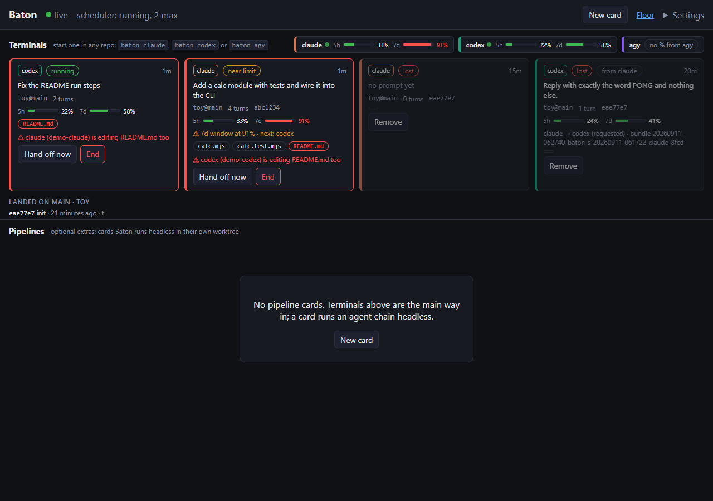

# baton

**Type `baton claude`, `baton codex` or `baton agy` instead of the bare command. You get the same interactive agent; Baton opens a board next to it, watches the usage limit, keeps a handoff bundle current, and when the limit hits it starts the next agent in the same terminal from that bundle.**

[](https://github.com/ucsandman/baton/actions/workflows/ci.yml)
[](LICENSE)
[](package.json)
[](package.json)
[](#network-exposure)



You keep using your coding agents exactly as you do today, in any terminal,
with your own settings, hooks and skills. `baton claude --model opus` is
`claude --model opus` with four things running alongside it:

1. **A board.** Opened once in your browser, reused after that. Every Baton
   session in every terminal is a card on it: agent, account, repo and branch,
   the task, the files it is touching, its 5h and 7d usage, what has landed on
   trunk. Two sessions editing the same file in one repo are flagged on both
   cards.
2. **Usage tracking** per agent and account, from what each CLI already
   exposes: Claude Code's usage endpoint and its `StopFailure` hook, Codex's
   session rollout file, agy's log.
3. **A context handoff bundle** ([context-handoff-bundle](https://pypi.org/project/context-handoff-bundle/))
   refreshed as the session goes, so the work is always ready to hand off.
4. **The handoff itself.** Near the limit you get a warning. At the limit Baton
   saves the bundle, stops the agent, and starts the next option in the same
   terminal from that bundle: another login of the same agent if you added
   one, otherwise the next agent (claude → codex → agy). Nothing is retyped.
   When every option is out, it tells you which resets first and when.

Subscription logins only: `ANTHROPIC_API_KEY`, `ANTHROPIC_AUTH_TOKEN`,
`ANTHROPIC_BASE_URL` and `OPENAI_API_KEY` are stripped before any agent
starts. Baton never edits `~/.claude/settings.json`, `~/.codex/config.toml`
or any other file of yours; `baton uninstall` removes only `~/.baton`.

## Contents

- [60-second run](#60-second-run)
- [What Baton reads from each agent](#what-baton-reads-from-each-agent)
- [How a handoff works](#how-a-handoff-works)
- [The board](#the-board)
- [Second accounts, and what the terms say](#second-accounts-and-what-the-terms-say)
- [What is and is not touched](#what-is-and-is-not-touched)
- [CLI reference](#cli-reference)
- [Pipelines: the v0.1 extras](#pipelines-the-v01-extras)
- [Troubleshooting](#troubleshooting)
- [Documentation](#documentation)
- [Contributing](#contributing)
- [License](#license)

## 60-second run

Prerequisites: Node 22 or newer, git, Python 3 with pip, and at least one
logged-in agent CLI (`claude`, `codex` or `agy`).

```
npm install -g agent-baton
pip install -U context-handoff-bundle
cd <any repo>
baton claude
```

That is the whole setup. The first `baton <agent>` starts the board on
http://127.0.0.1:4747 and opens it; later sessions reuse it. Anything after the
agent name passes straight through (`baton codex -m gpt-5.3-codex-spark`,
`baton claude --resume`). The agent's own prompt, permissions, hooks and skills
are untouched.

From a clone instead of npm: `git clone https://github.com/ucsandman/baton.git && cd baton && npm install && npm link`.

## What Baton reads from each agent

Nothing is guessed from screen scraping. Each tap was read from the CLI's
source or documentation and then checked on a real machine (2026-09-11,
Claude Code 2.1.268, codex-cli 0.153.4, agy 1.2.0); the rightmost column says
which.

| agent | usage percentages | the wall (limit hit) | how Baton attaches | status |
|-------|-------------------|----------------------|--------------------|--------|
| claude | `GET api.anthropic.com/api/oauth/usage` with the login Claude Code stored, the same data as `/usage` and the built-in status line (`five_hour`, `seven_day`, `utilization`, `resets_at`); polled every 60 s | `StopFailure` hook with `error: rate_limit` ([docs](https://code.claude.com/docs/en/hooks#stopfailure)) | one extra settings file per session via `--settings`: hooks merge with yours; `autoContinueAtUsageLimit` is set to `false` because Baton owns the handoff | observed live |
| codex | `event_msg.token_count.rate_limits` in the session's rollout file (`~/.codex/sessions/YYYY/MM/DD/rollout-*.jsonl`, flushed per event): `primary` = 300 min window, `secondary` = 10080 min | `task_complete.error.codex_error_info: usage_limit_exceeded`, message "You've hit your usage limit … try again at …" (`codex-rs/protocol/src/error.rs`) | Baton tails the rollout whose `session_meta.cwd` is the session's directory; no hook is injected, so codex never asks you to review a new hook | observed live |
| agy | none exposed (agy's own status line fetches a quota summary that is written nowhere) | `RESOURCE_EXHAUSTED`, "it resets in …", "out of quota" in the log (strings present in `agy.exe`) | `--log-file` per session; `~/.gemini/antigravity-cli/history.jsonl` gives the prompts and conversation id | log signals docs-only; prompts observed live |

Why not Claude Code's status line JSON (`rate_limits.five_hour.used_percentage`):
on 2.1.268 a custom `statusLine` command passed through `--settings` or a
project settings file is not run at all (an `echo` command at both levels left
the built-in status line in place; the hooks in the same `--settings` file
fire). Baton still writes a `statusLine` entry that records the same fields, so
the moment a build honours it the endpoint poll becomes a fallback. For that
session Baton's one-line status would replace a custom `statusLine` of yours;
your settings file itself is never changed.

## How a handoff works

1. **Warning.** At 85 % of any window (`BATON_WARN_PCT`) the session card turns
   amber, the event log names the next option, and the terminal bell rings once.
2. **Limit.** claude: the `StopFailure` hook fires with `rate_limit`. codex: the
   rollout reports `usage_limit_exceeded`. agy: the log says
   `RESOURCE_EXHAUSTED`. The account is marked walled until the reset the CLI
   reported (or the soonest known window reset).
3. **Bundle.** Baton writes structured notes (task, the last messages from the
   transcript, `git diff --stat`, dirty files, files edited this session, recent
   commits, why it stopped) and runs `context-handoff-bundle save --repo-local`
   with one slug per session, updated in place. A checkpoint of the same bundle
   is taken every two minutes while the session is active.
4. **Switch.** The agent process is stopped, the terminal is restored, and the
   next option starts in the same terminal with a short pointer prompt:
   read `.baton/RESUME.md` (the `context-handoff-bundle load` output plus the
   reason for the switch), check `git status` and `git diff`, continue, do not
   ask the human to restate the task. `claude "<prompt>"`, `codex "<prompt>"`
   and `agy -i "<prompt>"` all open the normal interactive session with that
   first turn.
5. **Order.** Other accounts of the same agent first, then the remaining agents
   in order, each tried once: from claude, `claude/work → codex → agy`; from
   codex, `agy → claude`. An option whose wall has not reset is skipped.
6. **All out.** The terminal prints each option with its reset time, soonest
   first, and exits 3. The card shows the same.

You can force a handoff any time: the **Hand off now** button on the card, or
`baton sessions handoff <id>`. Verified on this machine: `baton claude` opened
the real Claude Code TUI with all user hooks firing, the usage poll recorded
35 % / 92 %, the 92 % warning fired, a forced handoff saved the bundle, stopped
claude and started codex in the same terminal with the pointer prompt. A real
limit could not be forced live; the `rate_limit` path is covered by the hook
contract test.

## The board

`baton <agent>` opens it; `baton open` reopens it; `baton down` stops it.

- **Accounts strip**: one pill per login with the 5h and 7d bars, a live dot
  when a session is running on it, "limit · back <time>" when walled.
- **Terminal cards**: agent and account, status (starting, running, near limit,
  limit hit, handing off, ended, lost), the first prompt, repo@branch, turns,
  HEAD, usage bars, the files being touched (chips), and the warning, limit or
  handoff line. Two live sessions on one repo touching the same file get a red
  border and a "⚠ codex is editing README.md too" line on both cards.
- **Landed on trunk**: the last commits on `main` (or `master`) of every repo
  with a live session.
- **Buttons**: Hand off now, End (stops the agent), Remove (ended sessions).
- Below it, the v0.1 **Pipelines** columns for headless cards (see below).

The board reads `~/.baton/sessions/*/session.json` over server-sent events; a
session whose runner process is gone is marked `lost`, never shown as live.

## Second accounts, and what the terms say

Optional. `baton accounts add claude work` creates
`~/.baton/accounts/claude/work`, junctions your `hooks`, `skills`, `agents`,
`commands`, `plugins`, `rules`, `scripts`, `output-styles` and `tools` into it,
copies `settings.json`, `CLAUDE.md` and the status-line scripts (refreshed from
your real `~/.claude` before every launch), and prints one line to paste:

```
$env:CLAUDE_CONFIG_DIR='C:\Users\you\.baton\accounts\claude\work'; claude auth login
```

Same for codex (`CODEX_HOME`; `config.toml`, `AGENTS.md`, `skills`, `prompts`,
`rules`, `plugins`, `agents`, `hooks`, `memories` shared). agy 1.2.0 has no
config-directory override, so it stays one account. Only the login lives in
the account directory; `baton accounts rm` removes the junctions and the
directory and never touches your real home.

The terms, fetched 2026-09-11:

- Anthropic Consumer Terms (effective 2025-10-08): "You may not share your
  Account login information, Anthropic API key, or Account credentials with
  anyone else" and you "must not … bypass any of our systems or protective
  measures."
- Anthropic Usage Policy (effective 2025-09-15): do not "Coordinate malicious
  activity across multiple accounts to avoid detection or circumvent product
  guardrails" or "Utilize automation in account creation."
- OpenAI Terms of Use (effective 2026-01-01): "You may not share your account
  credentials or make your account available to anyone else" and you may not
  "circumvent any rate limits or restrictions or bypass any protective
  measures."

Owning two paid subscriptions is not named as prohibited by either. Rotating to
a second account of the same vendor because the first one is rate-limited sits
close to OpenAI's "circumvent any rate limits" wording and Anthropic's
"circumvent product guardrails". Baton's default chain switches vendors
(claude → codex → agy), which is plainly fine. Same-vendor rotation only
happens after you run `baton accounts add`; that is your call.

## What is and is not touched

- **Never edited**: `~/.claude/settings.json`, `~/.claude.json`,
  `~/.codex/config.toml`, agy's files, your repo's settings. Claude Code gets
  hooks through a per-session `--settings` file under `~/.baton`; codex and
  agy get nothing injected.
- **Written in your repo**: `.baton/` (session notes, `RESUME.md`) and
  `.context-handoffs/` (the bundles), both added to `.git/info/exclude`.
- **Stripped from every agent's environment**: the four API-key variables above,
  plus `CLAUDECODE` and `CLAUDE_CODE_*` markers a parent Claude session would
  leak (they make a nested Claude refuse to start).
- **Read but never written or printed**: Claude Code's stored login, sent only
  to `api.anthropic.com` for the usage numbers. The ledger scrubs bearer tokens
  and key shapes from every line regardless.
- **`baton uninstall --yes`**: removes `~/.baton` (sessions, usage, extra
  account directories with their junctions, v0.1 cards, the board pidfile) and
  nothing else; then `npm rm -g agent-baton`.

## CLI reference

```
baton claude|codex|agy [agent args…]   the interactive agent, board alongside, handoff on limit
baton sessions ls [--json]             every session and its usage
baton sessions show|events <id>
baton sessions handoff|end <id>        same as the board buttons
baton sessions rm <id>                 forget an ended session
baton accounts ls                      logins and their 5h/7d usage
baton accounts add <claude|codex> <name> | rm <agent> <name> | terms
baton open | down | status             the board
baton uninstall [--yes]
```

Environment, all optional: `BATON_HOME` (default `~/.baton`), `BATON_PORT`
(4747), `BATON_ACCOUNT` (start on a named login), `BATON_WARN_PCT` (85),
`BATON_NO_HANDOFF=1` (warn and record, never switch), `BATON_NO_OPEN=1` (do not
open the browser), `BATON_USAGE_POLL_MS` (60000), `BATON_CLAUDE_BIN`,
`BATON_CODEX_BIN`, `BATON_AGY_BIN`, `BATON_CHB_BIN`.

## Pipelines: the v0.1 extras

Version 0.1 was the other way round: you dropped a task card on the board and
Baton ran the agents headless in a git worktree, one per card, with a fallback
chain, path leases, a scheduler and a merge queue. All of that still works and
lives below the terminals lane, but it is no longer the way in.

- `baton up` boots the board with the scheduler and merge queue and streams
  redacted logs; `baton card add --repo <path> --task "<t>" --chain claude,codex --queue`
  creates a card; presets `build`, `build-land`, `factory`; station kinds
  agent, test, land, human.
- Adapters spawn the CLIs headless as argv, never through a shell, with their
  own permission modes and never a bypass flag: `claude -p --output-format json
  --permission-mode <m>`, `codex exec --json -s <m> -C <worktree>`,
  `agy -p --output-format json --mode <m> --add-dir <worktree>`; `fake`,
  `fake-claude`, `fake-codex`, `fake-agy` for tests and demos.
- A leg that ends on a limit signal, a stall, a crash or exit 0 without
  `.baton/DONE` hands off with a bundle to the next adapter in the same
  worktree; a `land` station rebases, tests and fast-forwards trunk or bounces
  the card with the failure in the bundle.
- Optional mirrors, off unless set in `.env`: OpenClaw Workboard
  (`BATON_SYNC_WORKBOARD=1`) and DashClaw (`BATON_SYNC_DASHCLAW=1`).

The full v0.1 story, with the fake-limit demo and the real claude→codex run,
is in [docs/concepts.md](docs/concepts.md), [docs/DEMO.md](docs/DEMO.md),
[docs/real-run.md](docs/real-run.md) and [docs/board-guide.md](docs/board-guide.md).

### Network exposure

Baton binds `127.0.0.1`. To listen elsewhere set `BATON_BIND` and
`BATON_TOKEN` together; without a token the server refuses to start (exit 3),
and requests then need `Authorization: Bearer <token>`. No TLS, no per-user
identity yet.

## Troubleshooting

- **The board did not open**: `baton open`, or visit http://127.0.0.1:4747.
  `~/.baton/board.log` has the server's output.
- **claude's card shows "claude usage unavailable"**: Claude Code has no stored
  claude.ai login in that config directory (run `claude auth login`), or the
  stored token expired (start `claude` once, it refreshes). The wall is still
  caught through the hook; only the percentages are missing.
- **codex's card never shows usage**: the rollout for that directory was not
  found. codex writes it only once a thread starts; a directory codex does not
  trust yet shows its trust prompt first, answer it and the tap catches up.
- **agy's card has no percentage**: expected, agy exposes none. Baton sees the
  wall when agy hits it.
- **A session shows `lost`**: the terminal that ran `baton <agent>` is gone
  (closed, crashed, machine slept through a kill). Remove it from the board.
- **Nested session**: `baton claude` typed inside a Claude Code shell works;
  the parent's `CLAUDECODE` markers are stripped so the child starts.
- **`npm install` dies with `edgesOut`** (clone only): the global npm is older
  than Node; run `npx --yes npm@latest install` once.

More in [docs/faq.md](docs/faq.md).

## Documentation

| guide | read it when |
|-------|--------------|
| [Getting started](docs/getting-started.md) | you want `baton claude` running in five minutes |
| [Concepts](docs/concepts.md) | sessions, accounts, bundles, and the v0.1 cards, stations, chains and leases |
| [Board guide](docs/board-guide.md) | every chip, glyph and button explained |
| [Configuration](docs/configuration.md) | environment variables and options |
| [Adapters](docs/adapters.md) | what each CLI exposes and how Baton attaches to it |
| [CLI contracts](docs/cli-contracts.md) | exact argv per CLI and the limit-signal table with sources |
| [FAQ](docs/faq.md) | a question the others did not answer |
| [Demo](docs/DEMO.md) and [real run](docs/real-run.md) | the v0.1 handoff, fake and real |
| [Vocabulary](docs/VOCABULARY.md) | statuses, outcomes and event types |
| [Roadmap v2](docs/ROADMAP-v2.md) | where this is going |
| [Reuse](docs/REUSE.md) and [deviations](docs/DEVIATIONS.md) | what was ported and every place the plan changed |

## Contributing

Issues and pull requests are welcome. Read [CONTRIBUTING.md](CONTRIBUTING.md)
for the dev setup and the rules (zero runtime deps, argv spawns only, no
bypass flags, a privacy check on every commit). Security reports go through
[SECURITY.md](SECURITY.md).

```
npm install
npm test          # node --test + privacy check
npm run lint
```

Any real agent session started only to test Baton runs on the cheapest model
(`baton claude --model haiku`); the live checks in `test/` never start one.

## Privacy and attribution

Parts of the runner, ledger and git snapshot were ported from a private
repository under the same MIT license (see [NOTICE](NOTICE) and
[docs/REUSE.md](docs/REUSE.md)), with chat identifiers, machine paths and
personal names removed. The test suite runs a privacy check on every commit,
and the fixtures store home paths as `~`.

## License

MIT, see [LICENSE](LICENSE).
