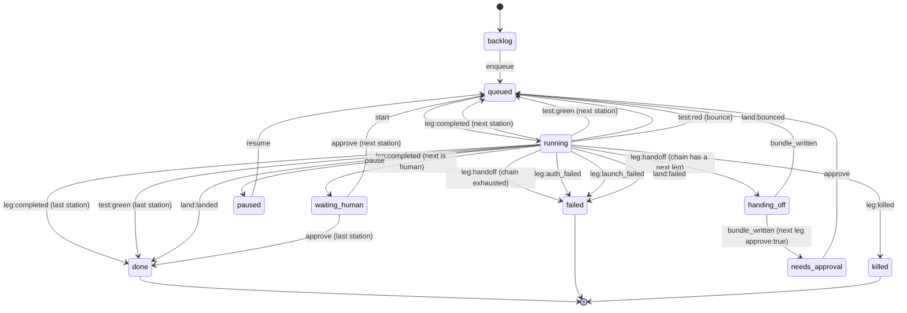

# Concepts

Two halves. The first four sections are the 0.2 way in: `baton claude` runs an
interactive agent and Baton watches it. The rest is the v0.1 pipeline, which
still works and now sits below the Terminals lane on the board. Read
[getting-started.md](getting-started.md) first if you have not run anything
yet.

## Sessions

A **session** is one terminal running one agent under Baton. `baton claude`,
`baton codex` and `baton agy` each create one. Baton spawns the real CLI with
stdio inherited, so the agent's own TUI, prompts, permissions, hooks and skills
are what you see; every argument after the agent name is passed through
unchanged.

Each session gets a directory under `$BATON_HOME/sessions/<id>/`
(`src/sessions.mjs`):

| file | what it holds |
|------|---------------|
| `session.json` | the live record the board renders; the runner is its only writer, and every write is one atomic replace |
| `events.jsonl` | the timeline (see [VOCABULARY.md](VOCABULARY.md#session-event-types)) |
| `control.json` | requests from the board to the runner, for example `{ handoff: true }` |
| `hook.log` | what Claude Code's hooks sent, claude sessions only |
| `claude-settings.json` | the per-session `--settings` file, claude sessions only |
| `agy.log` | agy's `--log-file`, agy sessions only |
| `land.json` | the last Land of a session with its own worktree (landing, landed, noop, bounced); the board server is its only writer |
| `requests.json` | hand-off requests from another human on a shared board (`{ by, at, state }`); the board server is its only writer |

A session's status is one of `starting`, `running`, `warning`, `limit`,
`handing_off`, `waiting`, `handed_off`, `ended`, `lost`. `lost` means the runner process
that owned the terminal is gone (closed window, crash); the board never shows
it as live.

The board is started detached on `127.0.0.1:4747` by the first session that
finds it down, and opened once. Later sessions reuse it.

## Accounts

An **account** is one login for one agent. `default` is the CLI's own home
(`~/.claude`, `~/.codex`). An extra account is a directory under
`$BATON_HOME/accounts/<agent>/<name>/` that the CLI is pointed at with its
config-directory variable: `CLAUDE_CONFIG_DIR` for claude, `CODEX_HOME` for
codex (`src/accounts.mjs` `LAYOUT`). agy 1.2.0 has no config-directory
override, so agy stays one account.

Your harness is shared into an extra account, never copied into a fork that
drifts: the directories are junctions back to the real home (claude: `hooks`,
`skills`, `agents`, `commands`, `plugins`, `rules`, `scripts`,
`output-styles`, `tools`; codex: `skills`, `prompts`, `rules`, `plugins`,
`agents`, `hooks`, `memories`, `superpowers`), and the settings files are
copied fresh before every launch (claude: `settings.json`,
`settings.local.json`, `CLAUDE.md`, `keybindings.json`, `statusline.ps1`,
`statusline-combined.ps1`; codex: `config.toml`, `AGENTS.md`). Only the login
itself lives in the account directory.

`baton accounts add <claude|codex> <name>` creates one and prints the single
line to paste to log in. `baton accounts rm` removes the junctions as links,
never following them, and deletes the directory. `baton accounts terms` prints
what both vendors' terms say about a second account; the quotes are in the
README.

## Usage windows

Every agent exposes two rolling windows: a 5-hour one and a 7-day one. Baton
keeps the latest reading per (agent, account) in
`$BATON_HOME/usage/<agent>--<account>.json` (`src/usage.mjs`):

```
{ five_hour: {pct, resets_at}, seven_day: {pct, resets_at},
  limited_until, limited_reason, source, updated_at }
```

Where each number comes from is per agent, and is in
[adapters.md](adapters.md). The rules on top of them are shared:

- **Warning** at `WARN_PCT`, default 85, settable with `BATON_WARN_PCT`. The
  highest percentage across the known windows is the pressure; the hottest
  window names the warning.
- **Wall.** `markLimited()` records `limited_until` from the reset time the CLI
  itself reported. With no reset time it uses the soonest known window reset,
  and with neither it assumes five hours.
- **Clearing.** A usage reading that arrives after `limited_until` has passed
  clears the wall.

## Handoff (interactive)

When a session hits its limit, or you press **Hand off now**, Baton does four
things in order (`src/attach.mjs`, `src/bundle.mjs`):

1. **Bundle.** `sessionNotes()` writes the six sections
   `context-handoff-bundle` parses (Scope, Projects mentioned, Findings,
   Opportunities, Open questions, Evidence anchors) from the task, the last
   messages in the transcript, `git diff --stat`, the dirty files, the files
   edited this session, recent commits and why it stopped. The CLI is called as
   `context-handoff-bundle save --repo-local --slug baton-<session id>`, with
   `--update <slug>` after the first time, so one bundle per session is updated
   in place. A checkpoint runs about every two minutes while the session has
   turns, and at every warning, limit and hand-off.
2. **Choose.** `candidates()` lists the other accounts of the same agent first,
   then every other agent in the terminal's saved order. That order is an
   absolute priority list, not a rotation anchored on the agent running now:
   an agent placed last is tried last whichever agent the terminal started on,
   and every option is still tried once. The default order is claude, codex,
   agy. `chooseNext()` skips a missing CLI or an option whose wall has not
   reset. The board can save a new order for an active terminal; the wrapper reads
   it again at the transition and during all-out waiting. Machine Settings is
   copied only when a new terminal starts.
3. **Switch.** The agent process is stopped and the terminal restored. The
   bundle's `context-handoff-bundle load <id>` output is written to
   `.baton/RESUME.md`, and the next agent starts in the same terminal with a
   short pointer prompt as its first positional argument: `claude "<prompt>"`,
   `codex "<prompt>"`, `agy -i "<prompt>"`. The prompt says to read
   `.baton/RESUME.md`, check `git status` and `git diff`, continue, and not ask
   the human to restate the task.
4. **All out.** If every option is walled, Baton prints each one with its reset
   time, soonest first, then waits in the terminal with a one-line countdown
   (`src/wait.mjs`) and starts the first option back from the bundle when its
   reset passes; if that option is walled again meanwhile it re-picks and
   waits again. The card records `session.all_out` and `session.waiting`
   (`{ agent, account, resets_at, since }`) and shows status `waiting`. Ctrl-C
   in the terminal, or End on the card, quits with exit 3.

`BATON_NO_HANDOFF=1` keeps the warning and the record but never switches.

## Share (more than one human)

`baton share` is off until you run it (`src/share.mjs`). On, it writes
`$BATON_HOME/share.json`: where the board listens, who is on it, and one
sha256 hash per person's token (the token itself is printed once). From then
on:

- Every `/api` request names a human: their token, or a browser on the board's
  own machine, which is the owner.
- A terminal belongs to the human who started it (`BATON_PERSON`, else the
  owner). Only they, and an owner, can read or control it.
- Everyone else sees the card without anything the terminal has said, read or
  written, and one button: Request handoff. The request lands in the session's
  `requests.json`; the owner approves it on the card, and the runner is told
  who it was for.
- The pipeline side of the board is the owner's alone (403 for a guest).

`baton share off` puts the board back on `127.0.0.1` and every link stops
working; `baton share rotate <name>` replaces one.

## Cards, stations and pipelines

Everything from here down is the v0.1 pipeline: headless agents in a git
worktree, one per card. It has not changed since 0.2.0 and is not the way in.

A **card** is one task moving through a **pipeline**: an ordered list of
**stations**. A station has a `kind`:

| kind | what runs |
|------|-----------|
| `agent` | the station's chain (one or more adapters, in fallback order) with that station's prompt |
| `human` | nothing automatic; the card parks in `waiting_human` for a button press |
| `test` | the repo's test command; red bounces the card back to the nearest earlier `build` agent station |
| `land` | the merge queue: rebase, test, fast-forward trunk (see [Land station](#the-land-station)) |

Three presets ship in `src/presets.mjs`:

| preset | stations |
|--------|----------|
| `build` | `build` (agent) |
| `build-land` | `build` (agent) → `test` → `land` |
| `factory` | `plan` (agent) → `build` (agent) → `review` (agent) → `test` → `land` |

A custom pipeline is a JSON array of stations passed as `--pipeline <file>`
or the board's "custom JSON" option. A `land` station must be last, and a
pipeline may have at most one.

## Chains and legs

A station's `chain` is an ordered list of adapters: the fallback order for
that station. Each entry is one **leg**. When a leg ends without finishing
(a limit, a stall, an incomplete exit, a failure), Baton writes a handoff
bundle and starts the next entry in the chain as the next leg, in the same
worktree. If the chain is exhausted, the card fails.

## Adapters and modes

Every adapter spawns its CLI as argv, never a shell, with its own permission
mode. Baton never passes a bypass/YOLO flag; requesting one throws before
anything spawns.

| adapter | default mode | allowed modes |
|---------|---------------|----------------|
| `claude` | `acceptEdits` | acceptEdits, auto, plan, manual, dontAsk |
| `codex` | `workspace-write` | read-only, workspace-write |
| `agy` | `accept-edits` | accept-edits, plan |
| `fake` (and `fake-claude`/`fake-codex`/`fake-agy`/`fake-nostdin`) | `acceptEdits` | acceptEdits, plan, workspace-write, read-only, accept-edits, auto_edit |
| `grok` (built, not registered) | `acceptEdits` | default, acceptEdits, auto, dontAsk, plan |

See [adapters.md](adapters.md) for each adapter's exact argv, forbidden
flags, and gotchas.

## The DONE marker contract

Every leg gets the same contract, regardless of which CLI runs it
(`src/contract.mjs`): a file written to `.baton/CONTRACT.md` in the
worktree, stating the task, the station's goal and deliverables, and the
finish rule:

> When the task is finished and verified, write the file `.baton/DONE`
> containing one line that summarizes what you did.

Agents are also asked to keep `.baton/PROGRESS.md` updated as they go, one
line per step. Without a fresh `.baton/DONE`, Baton treats the leg as
unfinished and hands it to the next agent in the chain, no matter what the
CLI printed.

## Outcomes and the classifier

`src/limits.mjs` `classify()` turns one leg's raw result (exit code, stdout,
stderr, the parsed result JSON, whether `.baton/DONE` exists, and the git or
filesystem diff since the leg started) into one outcome. It checks, in this
order, stopping at the first match:

1. a spawn error → `launch_failed`
2. stderr says "another auth source is set" → `auth_failed`
3. an adapter-specific or generic `auth` signal → `auth_failed`
4. killed from the board → `killed`
5. the kill timer fired → `stalled`
6. exit 0 and `.baton/DONE` present → `completed`
7. an adapter-specific or generic `limit` signal → `limit`
8. a `launch` signal → `launch_failed`
9. exit 0, changes present, no DONE marker → `incomplete`
10. exit 0, no DONE marker, no changes → `no_progress`
11. anything else (non-zero exit, no recognized signal) → `failed`

`completed`, `auth_failed` and `killed` never hand off. Every other outcome
(`limit`, `incomplete`, `no_progress`, `stalled`, `failed`) hands the card to
the next chain entry, or fails the card if the chain is exhausted.
`auth_failed` and `launch_failed` never advance the chain either way: a
human fixes the environment and presses Rerun. The signal fixtures behind
this table are in `fixtures/limits/` and documented per-CLI in
[cli-contracts.md](cli-contracts.md).

## Handoff bundles

When a leg needs to hand off, `src/handoff.mjs` calls the
`context-handoff-bundle` CLI as an argv subprocess (never re-implementing
its format): it writes a structured notes file, saves the bundle
repo-local in the worktree (`.context-handoffs/`), and validates it. The
notes carry six sections in the bundle's own vocabulary:

- **Scope**: the task, and which card/station/leg/adapter stopped with which
  outcome.
- **Projects mentioned**: the card id.
- **Findings**: `.baton/PROGRESS.md`'s lines, the previous agent's last
  message, the diff summary, the touched files.
- **Opportunities**: read `.baton/PROGRESS.md` and `.baton/CONTRACT.md`,
  continue from the last done step, then write `.baton/DONE`.
- **Open questions**: the outcome, the exit code, any bounce reason.
- **Evidence anchors**: the touched files, `.baton/PROGRESS.md`,
  `.baton/CONTRACT.md`.

The next leg's prompt starts with the bundle's `load` output (the resume
text) followed by the same contract.

## Worktrees

Every card runs in its own git worktree: `<repo>/.baton-worktrees/<card-id>`
on branch `baton/<card-id>` (`src/worktree.mjs`). The repo root is never
touched by an agent directly. Every git call sets `MSYS_NO_PATHCONV=1` so
Git Bash on Windows does not rewrite absolute path arguments. Baton never
pushes, opens a remote, or removes a path outside
`<repo>/.baton-worktrees/`.

Terminal sessions use the same layout when they would collide. A `baton
<agent>` started in a checkout where another session is live gets
`<repo>/.baton-worktrees/<session-id>` on `baton/<session-id>`, cut from the
branch the checkout has out (`isolate` in `src/attach.mjs`); its `repo` stays
the checkout, so the board groups it with the others. Its Land button runs the
same merge queue as a card's land station, with one difference: the checkout
is a live terminal and may have local changes of its own. Those are left alone,
and a fast-forward that would overwrite one bounces `dirty-trunk` naming the
files. `~/.baton/landings.jsonl` records every landing (session, agent, who
pressed Land, the commits) for the landed-on-trunk list.

## Leases and the scheduler

A card can declare **leases**: path globs it claims for the duration of its
run (default `**`, meaning the whole repo). `src/leases.mjs` decides whether
two cards' leases could touch the same files; the check is a deliberate
approximation biased toward false positives, because a wrongly serialized
card costs minutes and a wrongly parallel card can corrupt a merge.

`src/scheduler.mjs` ticks once a second by default: it reads every card's
`card.json` (never in-memory state), starts queued cards whose leases do not
overlap any running card's leases, up to `BATON_MAX_CONCURRENT` (default 2)
running at once, and records one `blocked_by` ledger event whenever a
card's blocker changes.

## The land station

A pipeline ending in a `land` station lands continuously. `src/mergequeue.mjs`
runs one land at a time per repo root, FIFO, and does, in order:

1. checks the repo root is on the trunk branch and clean; otherwise bounces
   `dirty-trunk` without touching the root;
2. commits whatever the agents left uncommitted in the worktree, then
   rebases the card's branch onto trunk; a conflict aborts the rebase and
   bounces `rebase-conflict` with the conflicting file list (a rebase git
   refuses for any other reason, a hook say, bounces `rebase-failed` with
   git's own words);
3. runs the test command (the card's `test_command`, else `npm test` from
   `package.json`, else `pytest` when there is a `pyproject.toml`, else it
   lands untested with a `land_warning`); red bounces `tests-red` with the
   last lines;
4. fast-forwards trunk from the repo root (`git merge --ff-only`); if trunk
   moved while the tests ran, it rebases once more and retries, then
   bounces `trunk-moved`;
5. on success, records a `landed` event with the sha, files, and line
   counts.

A bounce sends the card back to the nearest earlier `build` agent station
(or the first agent station) with the failure written into the next
handoff bundle's Open questions. `BATON_MAX_LAND_ATTEMPTS` (default 3) is a
shared cap: the `test` station's own bounces and the `land` station's
bounces both increment `land_attempts`, so a card that never goes green
cannot loop forever.

## The ledger and actors

`src/ledger.mjs` is the only writer of a card's on-disk state
(`$BATON_HOME/cards/<id>/`). Every event names an **actor**: `{type:
'agent', adapter}`, `{type: 'human', id}`, or `{type: 'baton'}`. Each actor
writes to its own `events-<actor-key>.jsonl` file (append-only); reading a
card's events merges every writer's file, sorted by timestamp. The board and
CLI read only these files; there is no separate in-memory state to fall out
of sync with a restart.

## Card status state diagram

Generated from `src/chain.mjs` `TRANSITIONS`. Two rules are not drawn as
per-state arrows because they apply broadly: `kill` moves any non-terminal
status (`backlog`, `queued`, `running`, `handing_off`, `waiting_human`,
`needs_approval`, `paused`) straight to `killed`, and `rerun` moves any
terminal status (`done`, `failed`, `killed`) back to `queued` (station 0,
leg 0). `reassign` also applies to any non-terminal status when the current
station is an agent station, staying in `queued`.



## See also

- [board-guide.md](board-guide.md): what each of these states looks like on
  the board.
- [adapters.md](adapters.md): the exact CLI shape behind each adapter.
- [configuration.md](configuration.md): the environment variables named
  above (`BATON_MAX_CONCURRENT`, `BATON_MAX_LAND_ATTEMPTS`, ...).
