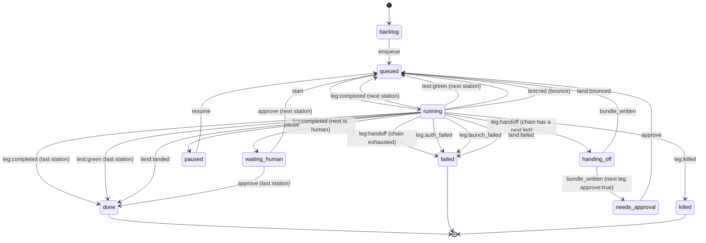

# Concepts

Two halves. The first four sections are the 0.2 way in: `leg claude` runs an
interactive agent and Leg watches it. The rest is the v0.1 pipeline, which
still works and now sits below the Terminals lane on the board. Read
[getting-started.md](getting-started.md) first if you have not run anything
yet.

## Sessions

A **session** is one terminal running one agent under Leg. `leg claude`,
`leg codex` and `leg agy` each create one. Leg spawns the real CLI with
stdio inherited, so the agent's own TUI, prompts, permissions, hooks and skills
are what you see; every argument after the agent name is passed through
unchanged.

Each session gets a directory under `$LEG_HOME/sessions/<id>/`
(`src/sessions.mjs`):

| file | what it holds |
|------|---------------|
| `session.json` | the live record the board renders; the runner is its only writer, and every write is one atomic replace |
| `events.jsonl` | the timeline (see [VOCABULARY.md](VOCABULARY.md#session-event-types)) |
| `control.json` | requests from the board to the runner, for example `{ handoff: true }` |
| `hook.log` | what Claude Code's hooks sent, claude sessions only |
| `claude-settings.json` | the per-session `--settings` file, claude sessions only |
| `agy.log` | agy's `--log-file`, agy sessions only |
| `land.json` | the last Land of a session with its own worktree (landing, landed, noop, bounced); the board server is its only writer |
| `requests.json` | hand-off requests from another human on a shared board (`{ by, at, state }`); the board server is its only writer |

A session's status is one of `starting`, `running`, `warning`, `limit`,
`handing_off`, `waiting`, `handed_off`, `ended`, `lost`. `lost` means the runner process
that owned the terminal is gone (closed window, crash); the board never shows
it as live.

Two fields on `session.json` say what the row is running and what it is stuck
on. `model` is the model this leg resolved to: the `--model` or `-m` the human
passed, else null. It is never a guessed default, because a model token nobody
chose is a wrong number in disguise. For claude the runner corrects it from the
transcript's per-message `model` while the agent works, so a silent fallback
off Fable is visible instead of being reported as the model you asked for.

`waiting` is null, or what this terminal is waiting for, in one of two shapes
told apart by `type`. `{ type: 'reset', agent, account, resets_at, since }` is
the all-out countdown: every option is walled and the terminal is waiting for
the first one back. `{ type, message, since }` with `type` one of
`permission_prompt`, `idle_prompt`, `agent_needs_input` or `quota_auto_resume`
is a human being waited on, from Claude Code's `Notification` hook (claude
sessions only); `message` is the question verbatim, cut at 160 characters, and
the next prompt or the end of the turn clears it. `quota_auto_resume` means
Claude Code is waiting at the limit by itself, and Leg's automatic hand-off
stands down for that terminal rather than making it wait twice.

Both are owner-only on a shared board, and a guest keeps both on their own
terminal: a terminal stopped at a permission prompt is useless to the person
sitting at it if the board will not say so, and it is nobody else's business.

The board is started detached on `127.0.0.1:4747` by the first session that
finds it down, and opened once. Later sessions reuse it.

## Accounts

An **account** is one login for one agent. `default` is the CLI's own home
(`~/.claude`, `~/.codex`). An extra account is a directory under
`$LEG_HOME/accounts/<agent>/<name>/` that the CLI is pointed at with its
config-directory variable: `CLAUDE_CONFIG_DIR` for claude, `CODEX_HOME` for
codex (`src/accounts.mjs` `LAYOUT`). agy 1.2.0 has no config-directory
override, so agy stays one account.

Your harness is shared into an extra account, never copied into a fork that
drifts: the directories are junctions back to the real home (claude: `hooks`,
`skills`, `agents`, `commands`, `plugins`, `rules`, `scripts`,
`output-styles`, `tools`; codex: `skills`, `prompts`, `rules`, `plugins`,
`agents`, `hooks`, `memories`, `superpowers`), and the settings files are
copied fresh before every launch (claude: `settings.json`,
`settings.local.json`, `CLAUDE.md`, `keybindings.json`, `statusline.ps1`,
`statusline-combined.ps1`; codex: `config.toml`, `AGENTS.md`). Only the login
itself lives in the account directory.

`leg accounts add <claude|codex> <name>` creates one and prints the single
line to paste to log in. `leg accounts rm` removes the junctions as links,
never following them, and deletes the directory. `leg accounts terms` prints
what both vendors' terms say about a second account; the quotes are in the
README.

## Usage windows

Every agent exposes two rolling windows: a 5-hour one and a 7-day one. Leg
keeps the latest reading per (agent, account) in
`$LEG_HOME/usage/<agent>--<account>.json` (`src/usage.mjs`):

```
{ five_hour: {pct, resets_at}, seven_day: {pct, resets_at},
  limited_until, limited_reason, source, updated_at,
  buckets, walls, history, extra_usage, facts }
```

A login can be limited per model as well as per account, so the record carries
both kinds of fact and keeps them apart. `buckets` is measured: one row per
bucket the agent publishes (`{kind, group, model, percent, resets_at,
is_active, severity}`, from Claude's `limits[]`), and `binding(u, model)` picks
the row that will actually stop a terminal. `walls` is attributed from wording
rather than measured: `bucketFromWall()` in `src/buckets.mjs` reads the wall
message, and a model-scoped wall goes to `walls[model]` while the login stays
open, so a Fable wall never stops `claude/sonnet`; a model wall with no clock of
its own is dated from that model's bucket, else from the weekly window, because
a per-model limit is a weekly fact and the five-hour clock would hand the model
back within the hour. `history` is a ring per bucket, capped by the clock first
and by 24 samples second: at most one sample a minute, none older than the
window it was measured in, and started again whenever that window resets (each
sample carries its own `resets_at`, so a bucket that is missing from one reading
cannot carry its old samples into the next window). Capping by count alone made
the forecast vanish from any login with three terminals on it, because three
pollers fill the ring three times as fast. `extra_usage` is the credits
sentence, and `facts` holds strings the
agent measured itself (codex's `plan_type` and `credits_balance`). An older Leg
reading this file ignores all five, and an agent that publishes no buckets
leaves them empty.

Where each number comes from is per agent, and is in
[adapters.md](adapters.md). The rules on top of them are shared:

- **Warning** at `WARN_PCT`, default 85, settable with `LEG_WARN_PCT`. The
  highest percentage across the known windows is the pressure; the hottest
  window names the warning.
- **Wall.** `markLimited()` records `limited_until` from the reset time the CLI
  itself reported. With no reset time, an account wall takes the window that
  actually walled (the highest used percentage, so a weekly wall is not
  recorded as the five-hour window's near reset) and a model wall takes that
  model's own bucket, else the weekly window. With neither it assumes five
  hours.
- **Clearing.** A usage reading that arrives after `limited_until` has passed
  clears the wall.

## Handoff (interactive)

A hand-off destination is a **rung**, not just an agent: `{agent, account,
model, when, cost}`. A rung can name a model, so a hand-off can move from
`claude/fable` to `claude/opus` without leaving the login, or it can leave the
model out and behave exactly like the plain agent destinations Leg has always
had. `preferences.json` keeps an ordered list of rungs, the **ladder**, tried
top first (`src/preferences.mjs`; the keys are documented in
[configuration.md](configuration.md)). `handoff_order`, the older list of
agents, is never removed: it is derived from the ladder's distinct agent order
every time the ladder is saved, so a reader that has never heard of rungs sees
the same order it always did.

When a session hits its limit, or you press **Hand off now**, Leg does four
things in order (`src/attach.mjs`, `src/bundle.mjs`). Which of the two it was
decides the gates below: a hand-off nobody asked for (the usage limit, and a
card the scheduler is driving) is **automatic** and keeps the `reserve` and the
`climb_back` policy; pressing **Hand off now** is a human pick and is not held
back by either, with or without a named destination, because the default option
in that picker ("the next option in the order") is still a press of the button.

1. **Bundle.** `sessionNotes()` writes the six sections
   `context-handoff-bundle` parses (Scope, Projects mentioned, Findings,
   Opportunities, Open questions, Evidence anchors) from the task, the last
   messages in the transcript, `git diff --stat`, the dirty files, the files
   edited this session, recent commits and why it stopped. The CLI is called as
   `context-handoff-bundle save --repo-local --slug leg-<session id>`, with
   `--update <slug>` after the first time, so one bundle per session is updated
   in place. A checkpoint runs about every two minutes while the session has
   turns, and at every warning, limit and hand-off.
2. **Choose.** `candidates()` lists the other accounts of the same agent first,
   then walks the ladder, and after each rung, the other accounts of that
   rung's agent. `evaluateLadder()` walks that list top to bottom and takes the
   first rung that clears every gate, checked in this order: the agent is
   installed on this machine; the rung was not excluded for this hand-off; its
   live cost (`rungCost()`, computed from usage, never trusted from disk) is
   `free` or `plan`, or `may_spend` is on, else the rung is skipped with the
   reason `it spends usage credits and you have not allowed that`; the rung
   sits on the same login the terminal just fell off of and what stopped that
   login is its own account-wide window, in which case another model there
   cannot help and the rung is skipped as `shares the window that is out, buys
   nothing`, whatever model it names; the account itself is not walled; the
   model, if the rung names one, is not walled; on an automatic hand-off with
   `climb_back` set to `never`, the rung is not a stronger model of the login
   the terminal just left (a human's own pick still reaches it; only an
   automatic climb is held back); the rung's login is not past its `reserve`
   floor; and its `when` is satisfied (`always`; `below:N`, which needs the
   rung's own bucket to read under N percent and is skipped with a reason when
   there is no reading, because a threshold on a login with no figure is a
   wrong number in disguise; `walled-only`, which only opens once no rung above
   it could take the hand-off anyway: walled, at 100 percent, not installed on
   this machine, or refused for this hand-off, but not merely slow and not
   merely dearer than `may_spend` allows). Every rung the walk passes before the one it picks is
   named in the session's ledger with its reason, one line each, for example
   `skipped claude/fable: it spends usage credits and you have not allowed
   that`; a rung is never passed over silently. The board can save a new
   ladder for an active terminal; the wrapper reads it again at the transition
   and during all-out waiting. Machine Settings is copied only when a new
   terminal starts.
3. **Switch.** The agent process is stopped and the terminal restored. A
   same-login move to a weaker claude model (a downshift, by the
   `fable, opus, sonnet, haiku` order) with the agent's own session id on the
   record keeps the conversation instead: Leg runs
   `claude --resume <agent_session_id> --model <alias>`, no bundle is written
   into a prompt, and the ledger says so. Every other rung, including an
   upshift back to a stronger model, a different account, or a different
   agent, takes the bundle: the `context-handoff-bundle load <id>` output
   (with the `## Synthesis` section prepended if
   `.leg/SYNTHESIS-<session-id>.md` is present) is written to
   `.leg/RESUME-<session-id>.md` and copied to `.leg/RESUME.md`, and the next
   agent starts in the same terminal with a short pointer prompt as its first
   positional argument: `claude "<prompt>"`, `codex "<prompt>"`,
   `agy -i "<prompt>"`. The prompt names the per-session file, directs the agent
   to read Synthesis first and treat ruled-out approaches as settled, and says to
   check `git status` and `git diff`, continue, and not ask the human to restate the
   task.
4. **All out.** If every option is walled, Leg prints each one with its reset
   time, soonest first, then waits in the terminal with a one-line countdown
   (`src/wait.mjs`) and starts the first option back from the bundle when its
   reset passes; if that option is walled again meanwhile it re-picks and
   waits again. The card records `session.all_out` and `session.waiting`
   (`{ agent, account, resets_at, since }`) and shows status `waiting`. Ctrl-C
   in the terminal, or End on the card, quits with exit 3.

`climb_back` decides what happens once a lower rung's own login recovers.
`next-handoff`, the default, needs no extra step: `chooseNext()` always walks
from rung 1, so the next time this terminal hands off it is offered the
higher rung again. `never` holds a terminal on the rung it downshifted to
until a human hands it off there by name; an automatic hand-off will not walk
back up on its own.

## The portable harness

Off by default. `leg harness enable` adds a step to the hand-off, between
**Choose** and **Switch**: the destination's working environment is prepared
before the destination starts. The source client (the one you actually
configure: Claude Code or Codex) is captured into a client-neutral bundle
under `~/.leg/harness/bundle/` (rules with their imports inlined, identity,
hooks, skills, subagents, slash commands, MCP servers with every credential
replaced by `${NAME}`, permissions), and that bundle is rendered into the
destination client's own files: `AGENTS.md`, `config.toml` regions and hook
trust entries for Codex; `GEMINI.md`, `hooks.json` and `mcp_config.json` for
agy; `leg-rules.md` plus one import line, hook groups and MCP servers for
Claude Code. Skills are linked, not copied. What a destination cannot
represent is dropped with a reason, and the session records exactly what
transferred (`session.harness`, the `harness` event, the **Harness** section
of the drawer).

The saved policy decides what an unattended hand-off may do: `warn` reports
and writes nothing, `sync` writes managed state when that is safe, `strict`
refuses a destination it cannot make safe and tries the next option. A
fingerprint of the source's files makes an unchanged environment free to
check. Everything Leg writes this way carries `GENERATED by Leg harness`, sits
in a marked region or an owned key inside files you also own, is backed up
before it is overwritten, and is skipped when you hand-edited it. The source
client is never written; credentials never move; which login runs is still the
account layer's decision. The whole contract is in [harness.md](harness.md).

## The resume pointer

`.leg/RESUME.md` is the file humans and other agents open by habit, so Leg
owns it and keeps it from describing a picture that is no longer true.

Every resume file starts with a stamp, an HTML comment that renders as nothing:

```
<!-- leg-resume {"v":1,"kind":"handoff","session":"s-…","head":"cf27986…",
     "branch":"main","dirty":{"count":12,"hash":"0a4c4f34ee93"},
     "live":[{"id":"s-…","agent":"claude"}],"bundle":"…","written_at":"…"} -->
```

The stamp says what was true when the file was written. It is never read as a
verdict. `leg resume --check` asks git what is true now and reports the
difference, so a file cannot lie about HEAD to a reader who re-asks git:

| state | when | exit |
| --- | --- | --- |
| current | the repository still matches the stamp, and the terminals it names are the ones that are live | 0 |
| stale | a commit landed, the working tree moved, the terminal it describes is gone, or another one appeared | 1 |
| unstamped | no Leg wrote this file, so nothing can be checked | 1 |
| missing | there is no `.leg/RESUME.md` from here up to the filesystem root | 3 |

The working-tree fingerprint is a count and a short hash of the sorted paths,
never the names: a shared board must not leak what someone is working on.
Leg's own directories (`.leg/`, `.context-handoffs/`) are left out of it, so
Leg's bookkeeping never reads as the human's work moving on.

Two things rewrite `RESUME.md` besides a hand-off. A session ending replaces it
with a "nothing in flight" pointer naming the last hand-off, its date and the
per-session file that still holds its full text. The board, at start, does the
same for any checkout whose pointer describes a terminal that is gone or that no
Leg stamped, the case where a terminal crashed instead of exiting. A terminal
that is genuinely still running keeps its own hand-off text; only the terminal
that owns a pointer may replace it.

`leg resume` prints the body, with a loud banner and a non-zero exit when it
is stale: a stale hand-off still beats nothing when a human chooses to read it,
and the exit code is what a script or a hook keys on. The terminal drawer's
"What happens next" section shows the same verdict, recomputed every poll.

`LEG_NO_HANDOFF=1` keeps the warning and the record but never switches.

## Share (more than one human)

`leg share` is off until you run it (`src/share.mjs`). On, it writes
`$LEG_HOME/share.json`: where the board listens, who is on it, and one
sha256 hash per person's token (the token itself is printed once). From then
on:

- Every `/api` request names a human: their token, or a browser on the board's
  own machine, which is the owner.
- A terminal belongs to the human who started it (`LEG_PERSON`, else the
  owner). Only they, and an owner, can read or control it.
- Everyone else sees the card without anything the terminal has said, read or
  written, and one button: Request handoff. The request lands in the session's
  `requests.json`; the owner approves it on the card, and the runner is told
  who it was for.
- The pipeline side of the board is the owner's alone (403 for a guest).

`leg share off` puts the board back on `127.0.0.1` and every link stops
working; `leg share rotate <name>` replaces one.

## Cards, stations and pipelines

A **card is a terminal you are not sitting at.** It has the same register
(state, where, model), the same one sentence, the same buttons, the same
fallback ladder and the same hand-off bundle as a terminal. Two differences
are real, and the board prints both: a card runs `-p --output-format json`,
which says nothing until the leg exits, so its sentence reads `no message
until this leg ends, started 11:04 PM`; and it never waits on a permission
prompt, because its permissions are decided before it starts.

Liveness decides where a card is drawn. A card in `backlog`, `queued`,
`running`, `handing_off`, `needs_approval`, `waiting_human` or `paused` is a
row in the Background panel under Terminals. A card in `done`, `failed` or
`killed` is one line in the ledger: `3 finished cards, 2 done, 1 failed, last
11:02 PM`. Ten finished cards are one row, not eleven.

A live card's row carries a **work stat**, and only the parts of it that were
measured: `4 files, +212 -18, tests green 6m ago`. The diff comes from `git
diff --shortstat <trunk>..HEAD` run in the card's own worktree; the test and
land verdicts come from that card's ledger. A part that was not measured is
left off, never estimated.

### A terminal becomes a card, and a card becomes a terminal

`End, and keep going as a card` (the second verb on a terminal's End confirm
row, `POST /api/sessions/<id>/end-as-card`) is for "I have to leave, keep
going". It writes the terminal's hand-off bundle at the path every hand-off
uses, creates a card whose task is the terminal's prompt plus `Continue from
the bundle at <path>.`, and then ends the terminal exactly the way End does.
The card **continues in the terminal's own worktree** rather than a fresh one:
two worktrees on one branch is a conflict machine, and the card carries
`worktree_adopted: true` so no later run cuts a second one over the top. Its
chain starts at the rung the terminal was standing on, not at the top of the
ladder, and `lineage.from` names the terminal it came from.

`Take over` in a card's expansion (`POST /api/cards/<id>/take-over`) is the way
back. It pauses the card, which kills its child and writes its bundle, then
hands back one command:

```
leg claude --resume-card card-20260917-2234-add-the-audit-csv-export
```

That opens an ordinary interactive terminal in the card's worktree, primed
from the card's bundle, with `lineage.from` naming the card. This is the one
place Leg hands a human a command to paste, because a terminal cannot be
opened from a browser tab, and the board says so on the line above it.

Everything from here down is the v0.1 pipeline mechanism: headless agents in a
git worktree, one per card.

A **card** is one task moving through a **pipeline**: an ordered list of
**stations**. A station has a `kind`:

| kind | what runs |
|------|-----------|
| `agent` | the station's chain (one or more adapters, in fallback order) with that station's prompt |
| `human` | nothing automatic; the card parks in `waiting_human` for a button press |
| `test` | the repo's test command; red bounces the card back to the nearest earlier `build` agent station |
| `land` | the merge queue: rebase, test, fast-forward trunk (see [Land station](#the-land-station)) |

Three presets ship in `src/presets.mjs`:

| preset | stations |
|--------|----------|
| `build` | `build` (agent) |
| `build-land` | `build` (agent) → `test` → `land` |
| `factory` | `plan` (agent) → `build` (agent) → `review` (agent) → `test` → `land` |

A custom pipeline is a JSON array of stations passed as `--pipeline <file>`
or the board's "custom JSON" option. A `land` station must be last, and a
pipeline may have at most one.

## Chains and legs

A station's `chain` is an ordered list of adapters: the fallback order for
that station. Each entry is one **leg**. When a leg ends without finishing
(a limit, a stall, an incomplete exit, a failure), Leg writes a handoff
bundle and starts the next entry in the chain as the next leg, in the same
worktree. If the chain is exhausted, the card fails.

## Adapters and modes

Every adapter spawns its CLI as argv, never a shell, with its own permission
mode. Leg never passes a bypass/YOLO flag; requesting one throws before
anything spawns.

| adapter | default mode | allowed modes |
|---------|---------------|----------------|
| `claude` | `acceptEdits` | acceptEdits, auto, plan, manual, dontAsk |
| `codex` | `workspace-write` | read-only, workspace-write |
| `agy` | `accept-edits` | accept-edits, plan |
| `fake` (and `fake-claude`/`fake-codex`/`fake-agy`/`fake-nostdin`) | `acceptEdits` | acceptEdits, plan, workspace-write, read-only, accept-edits, auto_edit |
| `grok` (built, not registered) | `acceptEdits` | default, acceptEdits, auto, dontAsk, plan |

See [adapters.md](adapters.md) for each adapter's exact argv, forbidden
flags, and gotchas.

## The DONE marker contract

Every leg gets the same contract, regardless of which CLI runs it
(`src/contract.mjs`): a file written to `.leg/CONTRACT.md` in the
worktree, stating the task, the station's goal and deliverables, and the
finish rule:

> When the task is finished and verified, write the file `.leg/DONE`
> containing one line that summarizes what you did.

Agents are also asked to keep `.leg/PROGRESS.md` updated as they go, one
line per step. Without a fresh `.leg/DONE`, Leg treats the leg as
unfinished and hands it to the next agent in the chain, no matter what the
CLI printed.

## Outcomes and the classifier

`src/limits.mjs` `classify()` turns one leg's raw result (exit code, stdout,
stderr, the parsed result JSON, whether `.leg/DONE` exists, and the git or
filesystem diff since the leg started) into one outcome. It checks, in this
order, stopping at the first match:

1. a spawn error → `launch_failed`
2. stderr says "another auth source is set" → `auth_failed`
3. an adapter-specific or generic `auth` signal → `auth_failed`
4. killed from the board → `killed`
5. the kill timer fired → `stalled`
6. exit 0 and `.leg/DONE` present → `completed`
7. an adapter-specific or generic `limit` signal → `limit`
8. a `launch` signal → `launch_failed`
9. exit 0, changes present, no DONE marker → `incomplete`
10. exit 0, no DONE marker, no changes → `no_progress`
11. anything else (non-zero exit, no recognized signal) → `failed`

`completed`, `auth_failed` and `killed` never hand off. Every other outcome
(`limit`, `incomplete`, `no_progress`, `stalled`, `failed`) hands the card to
the next chain entry, or fails the card if the chain is exhausted.
`auth_failed` and `launch_failed` never advance the chain either way: a
human fixes the environment and presses Rerun. The signal fixtures behind
this table are in `fixtures/limits/` and documented per-CLI in
[cli-contracts.md](cli-contracts.md).

## Handoff bundles

When a leg needs to hand off, `src/handoff.mjs` calls the
`context-handoff-bundle` CLI as an argv subprocess (never re-implementing
its format): it writes a structured notes file, saves the bundle
repo-local in the worktree (`.context-handoffs/`), and validates it. The
notes carry six sections in the bundle's own vocabulary:

- **Scope**: the task, and which card/station/leg/adapter stopped with which
  outcome.
- **Projects mentioned**: the card id.
- **Findings**: `.leg/PROGRESS.md`'s lines, the previous agent's last
  message, the diff summary, the touched files.
- **Opportunities**: read `.leg/PROGRESS.md` and `.leg/CONTRACT.md`,
  continue from the last done step, then write `.leg/DONE`.
- **Open questions**: the outcome, the exit code, any bounce reason.
- **Evidence anchors**: the touched files, `.leg/PROGRESS.md`,
  `.leg/CONTRACT.md`.

The next leg's prompt starts with the bundle's `load` output (the resume
text) followed by the same contract.

### The synthesis layer

Alongside raw state, Leg supports an agent-maintained judgment record in `.leg/SYNTHESIS-<session-id>.md`. At handoff time, Leg reads this file and inlines it verbatim into `.leg/RESUME-<session-id>.md` and `.leg/RESUME.md` as a `## Synthesis` section before the raw bundle dump.

- **Schema v1**: A 2-line header (`synthesis_version: 1`, `session: <id>  updated: <ISO-8601 UTC>`) followed by up to four optional sections in fixed order: `## Ruled out`, `## Decisions`, `## Next steps`, `## Open questions` (max 5 bullets each, one line per bullet).
- **Size cap**: 4 KB. Beyond that, Leg includes the first 4 KB plus a trailing `[synthesis truncated]` marker.
- **Resilience**: If the header is malformed, Leg still inlines the body prefixed with `[synthesis header invalid, rendering body as-is]`. If the file is absent or empty, no `## Synthesis` section is emitted and handoff degrades to today's raw dump.
- **Pointer prompt**: Directs the taking-over agent to read the Synthesis section first if present, treat ruled-out approaches as settled, and start from the top-ranked next step.
- **Board indicator**: Shows a `synthesis` chip on the terminal card when the synthesis file exists and was modified within the last 3 checkpoints.

## Worktrees

Every card runs in its own git worktree: `<repo>/.leg-worktrees/<card-id>`
on branch `leg/<card-id>` (`src/worktree.mjs`), with one exception: a card born
from `End, and keep going as a card` adopts the terminal's worktree and works
there, exactly where the terminal stopped. The repo root is never
touched by an agent directly. Every git call sets `MSYS_NO_PATHCONV=1` so
Git Bash on Windows does not rewrite absolute path arguments. Leg never
pushes, opens a remote, or removes a path outside
`<repo>/.leg-worktrees/`.

Terminal sessions use the same layout when they would collide. A `leg
<agent>` started in a checkout where another session is live gets
`<repo>/.leg-worktrees/<session-id>` on `leg/<session-id>`, cut from the
branch the checkout has out (`isolate` in `src/attach.mjs`); its `repo` stays
the checkout, so the board groups it with the others. Its Land button runs the
same merge queue as a card's land station, with one difference: the checkout
is a live terminal and may have local changes of its own. Those are left alone,
and a fast-forward that would overwrite one bounces `dirty-trunk` naming the
files. `~/.leg/landings.jsonl` records every landing (session, agent, who
pressed Land, the commits) for the landed-on-trunk list.

## Leases and the scheduler

A card can declare **leases**: path globs it claims for the duration of its
run (default `**`, meaning the whole repo). `src/leases.mjs` decides whether
two cards' leases could touch the same files; the check is a deliberate
approximation biased toward false positives, because a wrongly serialized
card costs minutes and a wrongly parallel card can corrupt a merge.

`src/scheduler.mjs` ticks once a second by default: it reads every card's
`card.json` (never in-memory state), starts queued cards whose leases do not
overlap any running card's leases, up to `LEG_MAX_CONCURRENT` (default 2)
running at once, and records one `blocked_by` ledger event whenever a
card's blocker changes.

## The land station

A pipeline ending in a `land` station lands continuously. `src/mergequeue.mjs`
runs one land at a time per repo root, FIFO, and does, in order:

1. checks the repo root is on the trunk branch and clean; otherwise bounces
   `dirty-trunk` without touching the root;
2. commits whatever the agents left uncommitted in the worktree, then
   rebases the card's branch onto trunk; a conflict aborts the rebase and
   bounces `rebase-conflict` with the conflicting file list (a rebase git
   refuses for any other reason, a hook say, bounces `rebase-failed` with
   git's own words);
3. runs the test command (the card's `test_command`, else `npm test` from
   `package.json`, else `pytest` when there is a `pyproject.toml`, else it
   lands untested with a `land_warning`); red bounces `tests-red` with the
   last lines;
4. fast-forwards trunk from the repo root (`git merge --ff-only`); if trunk
   moved while the tests ran, it rebases once more and retries, then
   bounces `trunk-moved`;
5. on success, records a `landed` event with the sha, files, and line
   counts.

A bounce sends the card back to the nearest earlier `build` agent station
(or the first agent station) with the failure written into the next
handoff bundle's Open questions. `LEG_MAX_LAND_ATTEMPTS` (default 3) is a
shared cap: the `test` station's own bounces and the `land` station's
bounces both increment `land_attempts`, so a card that never goes green
cannot loop forever.

## The ledger and actors

`src/ledger.mjs` is the only writer of a card's on-disk state
(`$LEG_HOME/cards/<id>/`). Every event names an **actor**: `{type:
'agent', adapter}`, `{type: 'human', id}`, or `{type: 'baton'}`. Each actor
writes to its own `events-<actor-key>.jsonl` file (append-only); reading a
card's events merges every writer's file, sorted by timestamp. The board and
CLI read only these files; there is no separate in-memory state to fall out
of sync with a restart.

## Card status state diagram

Generated from `src/chain.mjs` `TRANSITIONS`. Two rules are not drawn as
per-state arrows because they apply broadly: `kill` moves any non-terminal
status (`backlog`, `queued`, `running`, `handing_off`, `waiting_human`,
`needs_approval`, `paused`) straight to `killed`, and `rerun` moves any
terminal status (`done`, `failed`, `killed`) back to `queued` (station 0,
leg 0). `reassign` also applies to any non-terminal status when the current
station is an agent station, staying in `queued`, and `take_over` moves any
non-terminal status to `paused` (a human is taking the card's checkout, so the
scheduler must not start a leg in it).



## See also

- [board-guide.md](board-guide.md): what each of these states looks like on
  the board.
- [adapters.md](adapters.md): the exact CLI shape behind each adapter.
- [configuration.md](configuration.md): the environment variables named
  above (`LEG_MAX_CONCURRENT`, `LEG_MAX_LAND_ATTEMPTS`, ...).
