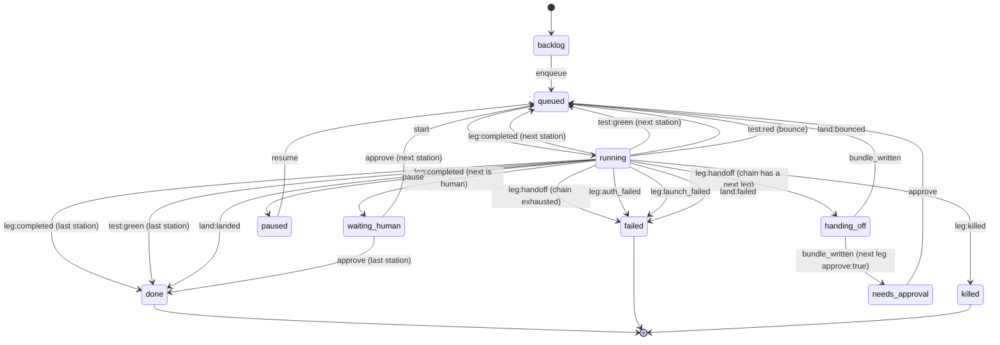

# Concepts

For anyone who wants to understand how Baton moves a card from a task to
landed code, before changing configuration or adding an adapter. Read
[getting-started.md](getting-started.md) first if you have not run a card
yet.

## Cards, stations and pipelines

A **card** is one task moving through a **pipeline**: an ordered list of
**stations**. A station has a `kind`:

| kind | what runs |
|------|-----------|
| `agent` | the station's chain (one or more adapters, in fallback order) with that station's prompt |
| `human` | nothing automatic; the card parks in `waiting_human` for a button press |
| `test` | the repo's test command; red bounces the card back to the nearest earlier `build` agent station |
| `land` | the merge queue: rebase, test, fast-forward trunk (see [Land station](#the-land-station)) |

Three presets ship in `src/presets.mjs`:

| preset | stations |
|--------|----------|
| `build` | `build` (agent) |
| `build-land` | `build` (agent) → `test` → `land` |
| `factory` | `plan` (agent) → `build` (agent) → `review` (agent) → `test` → `land` |

A custom pipeline is a JSON array of stations passed as `--pipeline <file>`
or the board's "custom JSON" option. A `land` station must be last, and a
pipeline may have at most one.

## Chains and legs

A station's `chain` is an ordered list of adapters: the fallback order for
that station. Each entry is one **leg**. When a leg ends without finishing
(a limit, a stall, an incomplete exit, a failure), Baton writes a handoff
bundle and starts the next entry in the chain as the next leg, in the same
worktree. If the chain is exhausted, the card fails.

## Adapters and modes

Every adapter spawns its CLI as argv, never a shell, with its own permission
mode. Baton never passes a bypass/YOLO flag; requesting one throws before
anything spawns.

| adapter | default mode | allowed modes |
|---------|---------------|----------------|
| `claude` | `acceptEdits` | acceptEdits, auto, plan, manual, dontAsk |
| `codex` | `workspace-write` | read-only, workspace-write |
| `gemini` | `auto_edit` | default, auto_edit, plan |
| `agy` | `accept-edits` | accept-edits, plan |
| `fake` (and `fake-claude`/`fake-codex`/`fake-gemini`/`fake-agy`) | `acceptEdits` | acceptEdits, plan, workspace-write, read-only, accept-edits, auto_edit |
| `grok` (built, not registered) | `acceptEdits` | default, acceptEdits, auto, dontAsk, plan |

See [adapters.md](adapters.md) for each adapter's exact argv, forbidden
flags, and gotchas.

## The DONE marker contract

Every leg gets the same contract, regardless of which CLI runs it
(`src/contract.mjs`): a file written to `.baton/CONTRACT.md` in the
worktree, stating the task, the station's goal and deliverables, and the
finish rule:

> When the task is finished and verified, write the file `.baton/DONE`
> containing one line that summarizes what you did.

Agents are also asked to keep `.baton/PROGRESS.md` updated as they go, one
line per step. Without a fresh `.baton/DONE`, Baton treats the leg as
unfinished and hands it to the next agent in the chain, no matter what the
CLI printed.

## Outcomes and the classifier

`src/limits.mjs` `classify()` turns one leg's raw result (exit code, stdout,
stderr, the parsed result JSON, whether `.baton/DONE` exists, and the git or
filesystem diff since the leg started) into one outcome. It checks, in this
order, stopping at the first match:

1. a spawn error → `launch_failed`
2. stderr says "another auth source is set" → `auth_failed`
3. an adapter-specific or generic `auth` signal → `auth_failed`
4. killed from the board → `killed`
5. the kill timer fired → `stalled`
6. exit 0 and `.baton/DONE` present → `completed`
7. an adapter-specific or generic `limit` signal → `limit`
8. a `launch` signal → `launch_failed`
9. exit 0, changes present, no DONE marker → `incomplete`
10. exit 0, no DONE marker, no changes → `no_progress`
11. anything else (non-zero exit, no recognized signal) → `failed`

`completed`, `auth_failed` and `killed` never hand off. Every other outcome
(`limit`, `incomplete`, `no_progress`, `stalled`, `failed`) hands the card to
the next chain entry, or fails the card if the chain is exhausted.
`auth_failed` and `launch_failed` never advance the chain either way: a
human fixes the environment and presses Rerun. The signal fixtures behind
this table are in `fixtures/limits/` and documented per-CLI in
[cli-contracts.md](cli-contracts.md).

## Handoff bundles

When a leg needs to hand off, `src/handoff.mjs` calls the
`context-handoff-bundle` CLI as an argv subprocess (never re-implementing
its format): it writes a structured notes file, saves the bundle
repo-local in the worktree (`.context-handoffs/`), and validates it. The
notes carry six sections in the bundle's own vocabulary:

- **Scope**: the task, and which card/station/leg/adapter stopped with which
  outcome.
- **Projects mentioned**: the card id.
- **Findings**: `.baton/PROGRESS.md`'s lines, the previous agent's last
  message, the diff summary, the touched files.
- **Opportunities**: read `.baton/PROGRESS.md` and `.baton/CONTRACT.md`,
  continue from the last done step, then write `.baton/DONE`.
- **Open questions**: the outcome, the exit code, any bounce reason.
- **Evidence anchors**: the touched files, `.baton/PROGRESS.md`,
  `.baton/CONTRACT.md`.

The next leg's prompt starts with the bundle's `load` output (the resume
text) followed by the same contract.

## Worktrees

Every card runs in its own git worktree: `<repo>/.baton-worktrees/<card-id>`
on branch `baton/<card-id>` (`src/worktree.mjs`). The repo root is never
touched by an agent directly. Every git call sets `MSYS_NO_PATHCONV=1` so
Git Bash on Windows does not rewrite absolute path arguments. Baton never
pushes, opens a remote, or removes a path outside
`<repo>/.baton-worktrees/`.

## Leases and the scheduler

A card can declare **leases**: path globs it claims for the duration of its
run (default `**`, meaning the whole repo). `src/leases.mjs` decides whether
two cards' leases could touch the same files; the check is a deliberate
approximation biased toward false positives, because a wrongly serialized
card costs minutes and a wrongly parallel card can corrupt a merge.

`src/scheduler.mjs` ticks once a second by default: it reads every card's
`card.json` (never in-memory state), starts queued cards whose leases do not
overlap any running card's leases, up to `BATON_MAX_CONCURRENT` (default 2)
running at once, and records one `blocked_by` ledger event whenever a
card's blocker changes.

## The land station

A pipeline ending in a `land` station lands continuously. `src/mergequeue.mjs`
runs one land at a time per repo root, FIFO, and does, in order:

1. checks the repo root is on the trunk branch and clean; otherwise bounces
   `dirty-trunk` without touching the root;
2. commits whatever the agents left uncommitted in the worktree, then
   rebases the card's branch onto trunk; a conflict aborts the rebase and
   bounces `rebase-conflict` with the conflicting file list;
3. runs the test command (the card's `test_command`, else `npm test` from
   `package.json`, else `pytest` when there is a `pyproject.toml`, else it
   lands untested with a `land_warning`); red bounces `tests-red` with the
   last lines;
4. fast-forwards trunk from the repo root (`git merge --ff-only`); if trunk
   moved while the tests ran, it rebases once more and retries, then
   bounces `trunk-moved`;
5. on success, records a `landed` event with the sha, files, and line
   counts.

A bounce sends the card back to the nearest earlier `build` agent station
(or the first agent station) with the failure written into the next
handoff bundle's Open questions. `BATON_MAX_LAND_ATTEMPTS` (default 3) is a
shared cap: the `test` station's own bounces and the `land` station's
bounces both increment `land_attempts`, so a card that never goes green
cannot loop forever.

## The ledger and actors

`src/ledger.mjs` is the only writer of a card's on-disk state
(`$BATON_HOME/cards/<id>/`). Every event names an **actor**: `{type:
'agent', adapter}`, `{type: 'human', id}`, or `{type: 'baton'}`. Each actor
writes to its own `events-<actor-key>.jsonl` file (append-only); reading a
card's events merges every writer's file, sorted by timestamp. The board and
CLI read only these files; there is no separate in-memory state to fall out
of sync with a restart.

## Card status state diagram

Generated from `src/chain.mjs` `TRANSITIONS`. Two rules are not drawn as
per-state arrows because they apply broadly: `kill` moves any non-terminal
status (`backlog`, `queued`, `running`, `handing_off`, `waiting_human`,
`needs_approval`, `paused`) straight to `killed`, and `rerun` moves any
terminal status (`done`, `failed`, `killed`) back to `queued` (station 0,
leg 0). `reassign` also applies to any non-terminal status when the current
station is an agent station, staying in `queued`.

## See also

- [board-guide.md](board-guide.md): what each of these states looks like on
  the board.
- [adapters.md](adapters.md): the exact CLI shape behind each adapter.
- [configuration.md](configuration.md): the environment variables named
  above (`BATON_MAX_CONCURRENT`, `BATON_MAX_LAND_ATTEMPTS`, ...).
